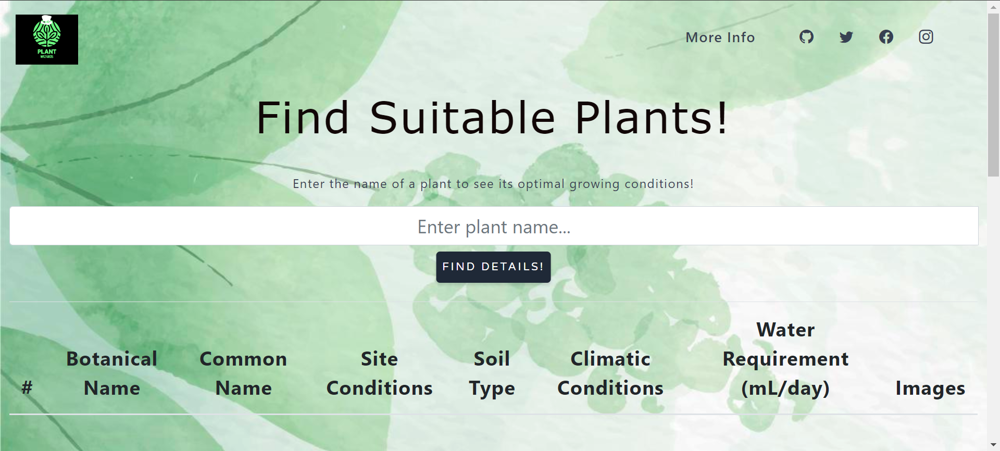
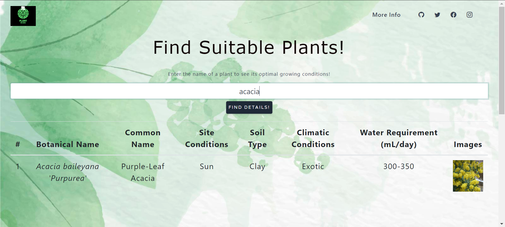
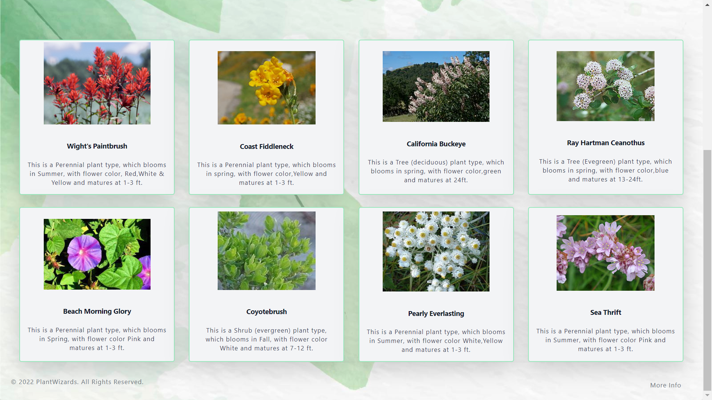

# Building process
This web app involved use of html, css and javascript to show the entries of csv file. This project is primarly constituted based on the fact that people are often confused about the plantation needs of indoor plants. This web app provides a comprehensive solution to that by giving all the optimal conditions required for a plant to grow. 

# Decision making
Our primary goal was to make a strategy to fetch and display the required data. For that reason we first compiled a list of all the easily available indoor plants in a csv file format. Afterwards we provided the required the planatation conditions like soil type, sunlight, e.t.c in that file. Next step was to use some effiient way to display that data. For that we used numerous libraries but we found out that D3 seems to be the best fit for our case. This library providied an easy implementation of fetching that data. In this process we also decided that what should our approach be towards the display of the data. These requirement were changing in that process.

# Challenges
We were having challenges regarding the user requirements, what should be added to the display. Similarly we were having challenges in getting the data particularly the images of the plants because it is hard to find the most common manifestation of that plant.

