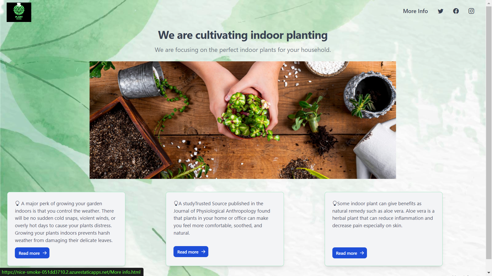

# Greentech
Social Impact League July-September 2022

[Check out the Prototype here](https://nice-smoke-051dd3710.2.azurestaticapps.net/)

# Team Name


# Team Members

[Aniq Javed](https://github.com/AniqJaved)

[Chino Ikwuegbu](https://github.com/slightlybae)

[Divit Mukhi](https://github.com/EncryptedBug)

[Om Prakash Sharma](https://github.com/ompiepy)


# Project Description

| Project Type      | *Prototype Sprint (Green Tech)* |
| ----------- | ----------- |
| Project Purpose      |    An WebApp so that people could be guided on how to grow plants which suits their needs and take the necessary care.    |

# Project Features


```Homepage```


```More Info Page```

- Provide information of the plants that can be cultivated indoor.

- Motivate them to cultivate and nurture the plants.

- Get information about Botanical Name, Common Name, size, Soil Type, Sunlight and Water Requirements and optimal growing conditions for plants.

- Make aware about the health benefits of the indoor plants.


# Future Changes

- Suggest the plants that are suitable to cultivate according to the Location of the user.

- Find out the information of plants by scanning its image

- Use Mixed Reality visualize how the space will look after the actual plantation.

- Integrate local vendors to supply the plants as per the requirement

- Make the Web App available for mobile users

# Links
[Problem Research.md](./Problem%20Research.md)

[Solution Identification.md](./Solution%20Identification.md) 

[Prototype.md](./Prototype.md)


